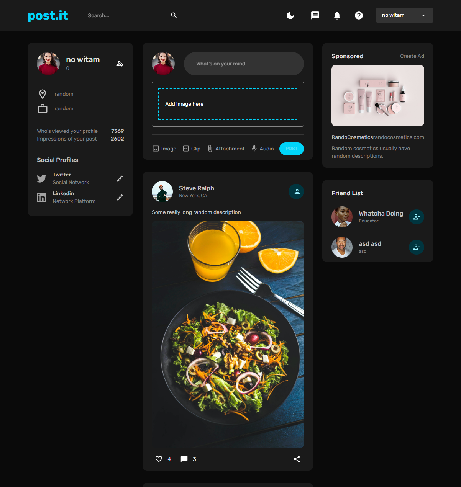
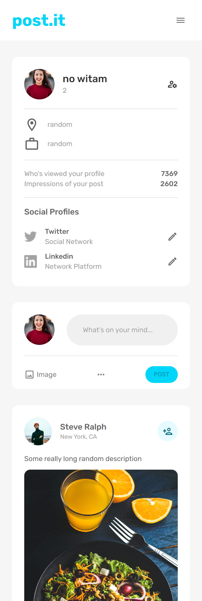
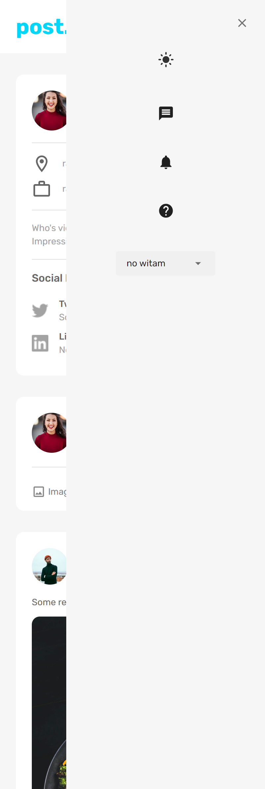

# post.it simple social application created for practice

## Features

- registration
- login
- add pictures
- add profile picture
- dark/light mode
- add posts
- like/remove like from posts
- add/remove friends
- responsive layouts
- display comments
- profile page
- home page
- friend list
- advertisement widget
- profile widget

## Data modeling

The following image represents data schemas for objects stored in MongoDB set up on Atlas cloud services.
[Data model](data.png)

## Technologies used

- Mongodb
  - Atlas Cloud Services
- React
  - React Router for navigation,
  - Formik & Yup to handle forms and validation,
  - Redux for state management,
  - Redux Toolkit for Redux setup,
  - Redux Persist to persist storage between app launches,
  - React dropzone to handle image uploading ui,
  - MUI for easy to setup Material UI and components,
- Node
  - Express as our web framework of choice for backend,
  - JWT for user authorization
  - Multer to handle form data and save pictures

## Application Preview

 

[light-mode](home-light.png)
[login](login.png)
[registration](registration.png)

## Credits

Project based on EdRoh fullstack tutorial (https://www.youtube.com/@EdRohDev).
